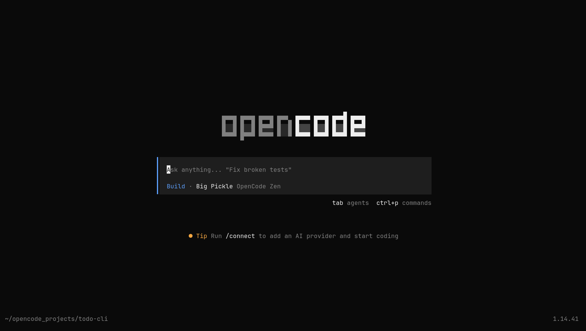
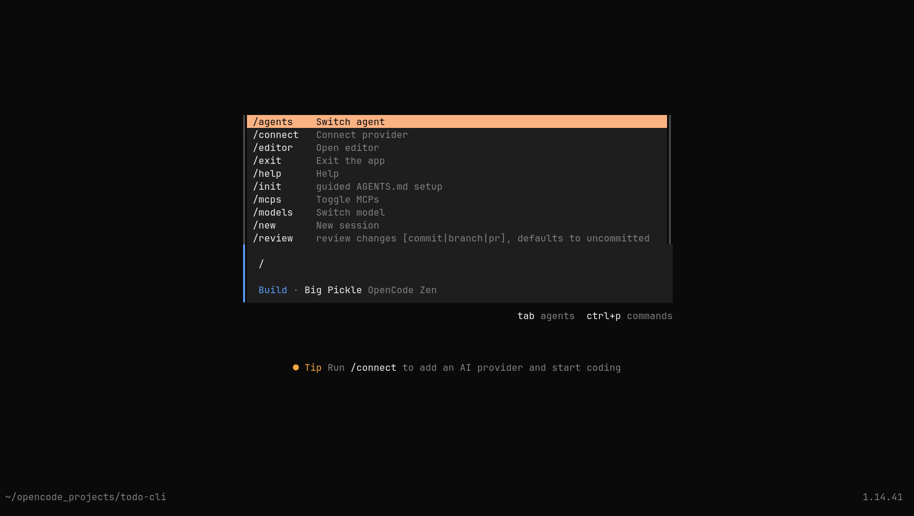
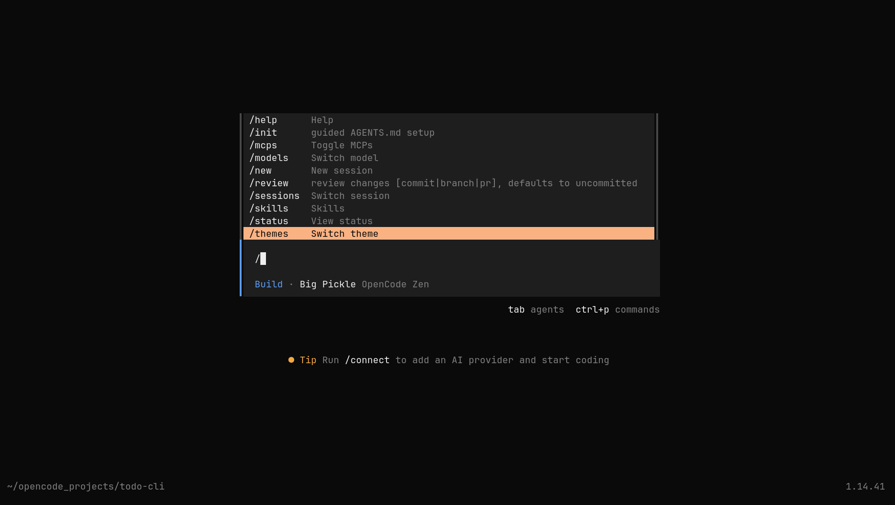
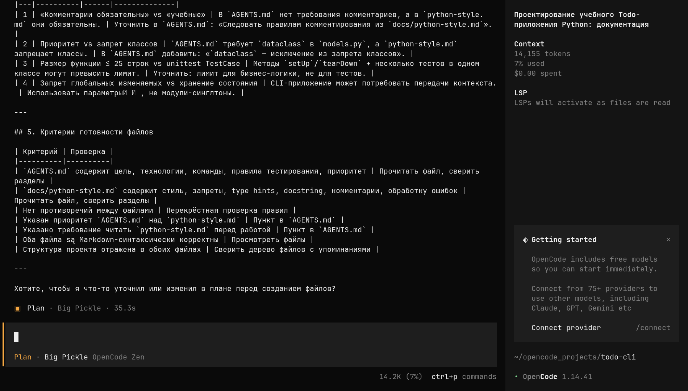
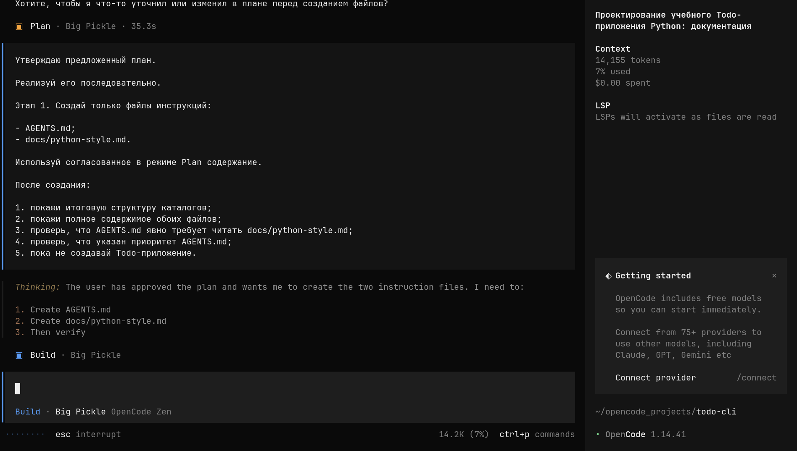
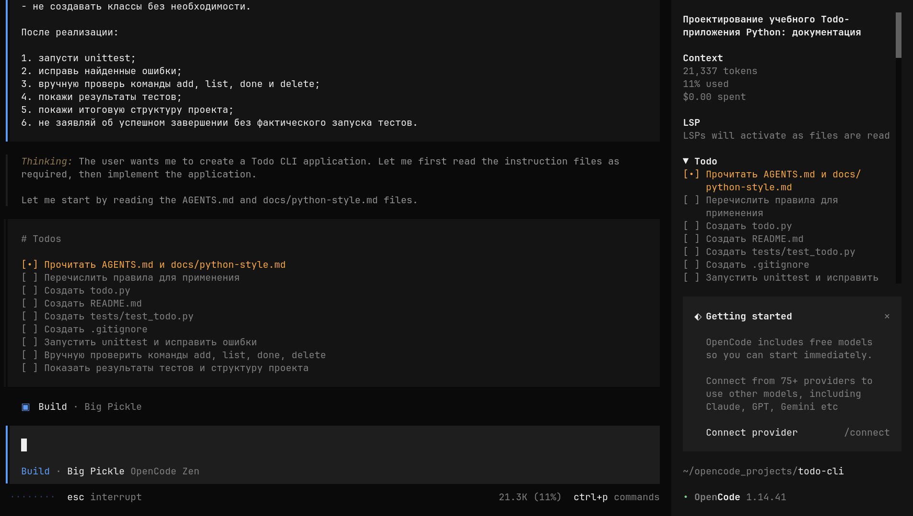
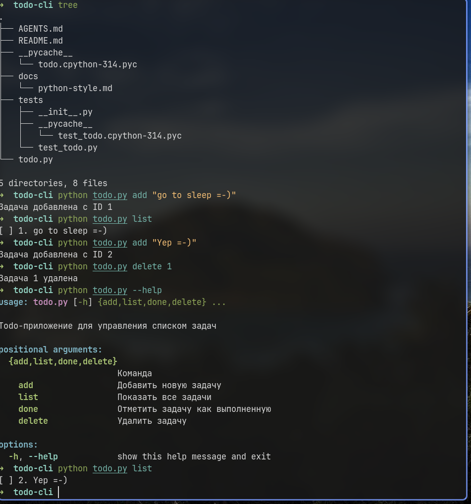

# OpenCode с нуля: установка и создание консольного Todo-приложения на Python

> Подробная пошаговая инструкция для человека, который впервые запускает ИИ-агента в терминале.
>
> В результате вы установите OpenCode, создадите проект, спроектируете правила в `AGENTS.md` и `docs/python-style.md`, а затем поручите агенту написать, протестировать и проверить консольное Todo-приложение.

**Актуальность команд:** 25 июля 2026 года.  
**Пример на скриншотах:** OpenCode `1.14.41`, OpenCode Zen, бесплатная модель **Big Pickle**.  
**Фактический расход в показанном учебном проходе:** **41 536 токенов**, при этом в интерфейсе отображалось **$0.00 spent**, потому что использовалась бесплатная модель.

---

## Содержание

1. [Что вы создадите](#что-вы-создадите)
2. [0. Что такое агентный сценарий работы с ИИ](#0-что-такое-агентный-сценарий-работы-с-ии)
3. [1. Установка OpenCode](#1-установка-opencode)
   - [Linux](#11-linux)
   - [macOS](#12-macos)
   - [Windows](#13-windows)
4. [2. Подготовка учебного проекта](#2-подготовка-учебного-проекта)
5. [3. Знакомство с интерфейсом OpenCode по скриншотам](#3-знакомство-с-интерфейсом-opencode-по-скриншотам)
6. [4. Проектирование инструкций в режиме Plan](#4-проектирование-инструкций-в-режиме-plan)
7. [5. Создание файлов инструкций в режиме Build](#5-создание-файлов-инструкций-в-режиме-build)
8. [6. Создание Todo-приложения](#6-создание-todo-приложения)
9. [7. Ручная проверка результата](#7-ручная-проверка-результата)
10. [8. Проверка Git и сохранение проекта](#8-проверка-git-и-сохранение-проекта)
11. [9. Что делать с `/init`](#9-что-делать-с-init)
12. [10. Безопасная работа с ИИ-агентом](#10-безопасная-работа-с-ии-агентом)
13. [11. Частые проблемы](#11-частые-проблемы)
14. [12. Итоговый чек-лист](#12-итоговый-чек-лист)
15. [Источники](#источники)

---

# Что вы создадите

Проект будет выглядеть примерно так:

```text
todo-cli/
├── .gitignore
├── AGENTS.md
├── README.md
├── docs/
│   └── python-style.md
├── tests/
│   ├── __init__.py            # может быть создан агентом
│   └── test_todo.py
└── todo.py
```

После первого добавления задачи появится файл с пользовательскими данными:

```text
todo.json
```

В приложении будут команды:

```bash
python todo.py add "Текст задачи"
python todo.py list
python todo.py done 1
python todo.py delete 1
```

На некоторых системах команда Python называется `python3`. Тогда используйте:

```bash
python3 todo.py list
```

Приложение будет уметь:

- добавлять задачу;
- показывать список задач;
- отмечать задачу выполненной;
- удалять задачу;
- хранить данные в JSON-файле;
- сообщать об ошибках понятным текстом;
- восстанавливаться при отсутствии файла данных;
- обрабатывать повреждённый JSON;
- проходить автоматические тесты `unittest`.

---

# 0. Что такое агентный сценарий работы с ИИ

Раздел основан на формулировках из файла `it_career_tracks_junior_to_senior.md`.

## 0.1. Чем ИИ-агент отличается от обычного чата

В обычном пользовательском сценарии вы задаёте вопрос в браузере, а модель отвечает текстом. Например, она может показать пример функции, объяснить ошибку или написать черновик README.

**ИИ-агент** работает глубже. Ему предоставляются инструменты, с помощью которых он может выполнять последовательность реальных действий в рабочем каталоге:

1. прочитать структуру репозитория;
2. открыть существующие файлы;
3. найти нужные фрагменты кода;
4. составить план;
5. создать новые файлы;
6. изменить существующие файлы;
7. запустить команды терминала;
8. запустить тесты и линтеры;
9. исправить найденные ошибки;
10. показать итоговый diff или подготовить изменения для pull request.

Примеры таких инструментов — **OpenCode** и **Codex**.

## 0.2. Может ли агент полностью выполнить задачу

Технически агент способен пройти весь небольшой цикл разработки самостоятельно:

```text
прочитать требования
→ спроектировать решение
→ написать код
→ создать тесты
→ запустить тесты
→ исправить ошибки
→ обновить документацию
→ показать результат
```

Для учебного Todo-приложения агент действительно может сделать почти всю механическую работу.

Однако фраза «агент сделал всё» не означает, что человек больше не нужен. Агент:

- не несёт ответственность за результат;
- может неверно понять требование;
- может создать формально работающий, но неудобный код;
- может пропустить граничный случай;
- может написать слабые тесты, которые подтверждают собственную ошибочную реализацию;
- может выполнить лишнюю команду;
- может изменить файл, который вы не просили менять;
- может уверенно сообщить об успехе без достаточной проверки.

Поэтому правильная модель работы выглядит так:

```text
агент выполняет техническую работу
→ тесты дают машинную проверку
→ человек проводит ревью
→ человек принимает или отклоняет результат
```

## 0.3. Что должен делать человек

Человек должен уметь:

- ставить ограниченную и проверяемую задачу;
- задавать правила через `AGENTS.md`, README и дополнительные инструкции;
- разделять проектирование и выполнение;
- контролировать разрешения на команды и файлы;
- требовать фактический запуск тестов;
- читать созданные файлы;
- проверять `git diff`;
- вручную запускать ключевые сценарии;
- не предоставлять бесконтрольный доступ к production;
- не передавать секреты и персональные данные;
- принимать финальное решение самостоятельно.

## 0.4. Главный принцип

> **Агент может полностью выполнить рабочий процесс, но человек обязан проверить и подтвердить результат.**

В этой инструкции поэтому используется трёхэтапный подход:

```text
Plan: сначала спроектировать
→ Build: затем создать
→ Review: после этого проверить
```

---

# 1. Установка OpenCode

OpenCode — open-source ИИ-агент, который запускается в терминале. Для работы учебного проекта понадобятся:

- OpenCode;
- Python 3;
- Git;
- современный терминал;
- интернет для обращения к облачной модели;
- необязательно, но удобно: утилита `tree`.

## 1.0. Что такое терминал

Терминал — окно, в которое вводятся текстовые команды.

Примеры:

- Linux: Konsole, GNOME Terminal, Kitty, Alacritty, Ghostty;
- macOS: Terminal, iTerm2, Kitty, Ghostty;
- Windows: Windows Terminal, PowerShell, терминал Ubuntu в WSL.

Команды вводятся по одной строке. После команды нажимайте `Enter`.

---

## 1.1. Linux

### Вариант A. Arch Linux и производные с `pacman`

Это основной вариант для системы из примера.

Откройте терминал и обновите список пакетов и систему:

```bash
sudo pacman -Syu
```

Установите OpenCode, Python, Git и `tree`:

```bash
sudo pacman -S --needed opencode python git tree
```

Что означает команда:

- `sudo` — выполнить установку с правами администратора;
- `pacman` — пакетный менеджер Arch Linux;
- `-S` — установить пакеты;
- `--needed` — не переустанавливать уже установленные пакеты;
- `opencode` — ИИ-агент;
- `python` — интерпретатор Python;
- `git` — система контроля версий;
- `tree` — красивый вывод структуры папок.

Проверьте установку:

```bash
opencode --version
python --version
git --version
tree --version
```

Вы должны увидеть номера версий. Например:

```text
1.14.41
Python 3.14.x
git version 2.x.x
tree v2.x.x
```

Точные номера могут отличаться — это нормально.

#### Необязательный вариант из AUR

Официальная документация также показывает AUR-пакет последней версии:

```bash
paru -S opencode-bin
```

Новичку рекомендуется начать со стабильного пакета:

```bash
sudo pacman -S opencode
```

### Вариант B. Ubuntu, Debian и Linux Mint

Установите базовые инструменты:

```bash
sudo apt update
sudo apt install -y curl git python3 python3-venv tree
```

Установите OpenCode официальным скриптом:

```bash
curl -fsSL https://opencode.ai/install | bash
```

Закройте и снова откройте терминал. Затем проверьте:

```bash
opencode --version
python3 --version
git --version
```

На Ubuntu обычно используется команда `python3`, а не `python`.

### Вариант C. Fedora

```bash
sudo dnf install -y curl git python3 tree
curl -fsSL https://opencode.ai/install | bash
```

Перезапустите терминал и проверьте:

```bash
opencode --version
python3 --version
git --version
```

### Универсальный официальный способ для Linux

Официальная документация OpenCode предлагает:

```bash
curl -fsSL https://opencode.ai/install | bash
```

Этот способ удобен, если OpenCode отсутствует в репозитории вашего дистрибутива.

> Перед запуском любого скрипта из интернета в рабочей или корпоративной среде согласуйте это с администратором. Для личного учебного компьютера используйте только официальный адрес `opencode.ai`.

---

## 1.2. macOS

### Шаг 1. Установите Homebrew, если его ещё нет

Проверьте:

```bash
brew --version
```

Если терминал пишет `command not found`, установите Homebrew официальной командой с сайта Homebrew:

```bash
/bin/bash -c "$(curl -fsSL https://raw.githubusercontent.com/Homebrew/install/HEAD/install.sh)"
```

В конце установщик может показать команды, которые нужно выполнить для добавления `brew` в `PATH`. Скопируйте и выполните именно те команды, которые покажет ваш терминал.

Закройте и снова откройте терминал. Проверьте:

```bash
brew --version
```

### Шаг 2. Установите OpenCode, Python, Git и tree

Официальная документация рекомендует tap OpenCode, потому что он обновляется быстрее основной формулы Homebrew:

```bash
brew install anomalyco/tap/opencode python git tree
```

Проверьте:

```bash
opencode --version
python3 --version
git --version
tree --version
```

На macOS в командах проекта безопаснее использовать:

```bash
python3 todo.py list
```

Если команда `python` также доступна и показывает Python 3, можно пользоваться ею.

---

## 1.3. Windows

Официальная документация OpenCode рекомендует **WSL — Windows Subsystem for Linux**, потому что этот вариант обеспечивает лучшую совместимость с возможностями агента.

### Рекомендуемый вариант: Windows + WSL + Ubuntu

#### Шаг 1. Установите WSL

Откройте меню «Пуск», найдите **PowerShell**, нажмите правой кнопкой и выберите **Запуск от имени администратора**.

Введите:

```powershell
wsl --install
```

Перезагрузите компьютер.

Команда обычно устанавливает Ubuntu по умолчанию. При первом запуске Ubuntu попросит создать:

- Linux-имя пользователя;
- Linux-пароль.

Когда вы вводите пароль в Linux-терминале, символы не отображаются — это нормально.

Проверьте версию WSL из PowerShell:

```powershell
wsl --list --verbose
```

Желательно, чтобы Ubuntu использовала WSL 2.

#### Шаг 2. Откройте Ubuntu

Откройте «Пуск» → `Ubuntu`.

Дальнейшие команды вводите **в терминале Ubuntu**, а не в PowerShell.

#### Шаг 3. Установите инструменты внутри Ubuntu

```bash
sudo apt update
sudo apt install -y curl git python3 python3-venv tree
```

Установите OpenCode:

```bash
curl -fsSL https://opencode.ai/install | bash
```

Закройте и снова откройте окно Ubuntu. Проверьте:

```bash
opencode --version
python3 --version
git --version
```

#### Где хранить проект

Для первого проекта создайте его в домашней Linux-папке:

```bash
mkdir -p ~/opencode_projects
```

Это проще, чем смешивать пути Windows вида `C:\Users\...` и Linux-пути вида `/home/...`.

### Нативные варианты для Windows

Официальная документация также перечисляет:

```powershell
choco install opencode
```

или:

```powershell
scoop install opencode
```

или через Node.js:

```powershell
npm install -g opencode-ai
```

Но для данного учебного проекта новичку рекомендуется WSL, потому что все команды в инструкции будут одинаковыми с Linux.

---

## 1.4. Первичная настройка Git

Проверьте текущую конфигурацию:

```bash
git config --global user.name
git config --global user.email
```

Если команды ничего не вывели, задайте имя и email:

```bash
git config --global user.name "Ваше Имя"
git config --global user.email "you@example.com"
```

Это нужно для будущих коммитов. Email может быть адресом, который вы используете на GitHub, либо приватным GitHub noreply-адресом.

---

## 1.5. Бесплатная модель Big Pickle и OpenCode Zen

На скриншотах используется:

```text
Build · Big Pickle OpenCode Zen
```

По состоянию на 25 июля 2026 года официальная документация OpenCode указывает Big Pickle как бесплатную модель OpenCode Zen **на ограниченный период**.

Это означает:

- стоимость входных и выходных токенов сейчас указана как бесплатная;
- доступ может быть временным;
- состав бесплатных моделей может измениться;
- бесплатность не следует считать вечной гарантией;
- данные бесплатного периода Big Pickle могут использоваться для улучшения модели.

Поэтому не отправляйте в бесплатную модель:

- пароли;
- API-ключи;
- персональные данные;
- коммерческую тайну;
- закрытый исходный код без разрешения;
- конфиденциальные документы.

### Как выбрать модель

После запуска OpenCode можно открыть список моделей:

```text
/models
```

Выбирайте модель, у которой явно указано `Free`, либо Big Pickle, пока она отмечена бесплатной.

### Если OpenCode просит подключить провайдера

Введите:

```text
/connect
```

Выберите OpenCode / OpenCode Zen и следуйте инструкции интерфейса.

В разных версиях OpenCode бесплатная модель может быть доступна сразу, как на скриншоте, либо интерфейс может попросить авторизоваться. Проверяйте строку модели и счётчик расходов в интерфейсе.

---

# 2. Подготовка учебного проекта

## 2.1. Создайте общую папку проектов

Linux, macOS или WSL:

```bash
mkdir -p ~/opencode_projects
cd ~/opencode_projects
```

Команда `mkdir -p` создаёт папку, если её ещё нет. Команда `cd` переходит в неё.

## 2.2. Создайте папку Todo-проекта

```bash
mkdir todo-cli
cd todo-cli
```

Проверьте текущую папку:

```bash
pwd
```

Вы должны увидеть путь, заканчивающийся на:

```text
/opencode_projects/todo-cli
```

## 2.3. Инициализируйте Git

```bash
git init
```

Почему это полезно сразу:

- Git показывает, какие файлы изменились;
- можно сохранить рабочую версию;
- можно отменять нежелательные изменения;
- некоторые функции OpenCode `/undo` и `/redo` используют Git;
- проще провести ревью через `git diff`.

Проверьте:

```bash
git status
```

Для пустого проекта будет сообщение о том, что коммитов ещё нет.

## 2.4. Запустите OpenCode из папки проекта

```bash
opencode
```

OpenCode будет считать текущую папку корнем проекта. Поэтому важно запустить его именно из `todo-cli`.

---

# 3. Знакомство с интерфейсом OpenCode по скриншотам

## Скриншот 1. Стартовый экран



На экране видны основные элементы.

### Центральное поле ввода

Строка:

```text
Ask anything... "Fix broken tests"
```

— это место, куда вводится обычный запрос или команда со слешем.

Курсор уже находится в поле ввода. Можно сразу печатать.

### Строка режима и модели

```text
Build · Big Pickle OpenCode Zen
```

Она показывает:

- `Build` — активный основной агент;
- `Big Pickle` — выбранная модель;
- `OpenCode Zen` — провайдер модели.

### Что означает Build

В режиме Build агент может:

- читать файлы;
- создавать файлы;
- изменять файлы;
- запускать команды;
- запускать тесты.

Именно поэтому не следует начинать с неясного запроса в Build. Сначала лучше переключиться в Plan и согласовать план.

### Подсказка `tab agents`

Она сообщает, что клавиша `Tab` переключает основных агентов, прежде всего:

```text
Build ↔ Plan
```

### Подсказка `ctrl+p commands`

Сочетание `Ctrl+P` открывает палитру команд. Список команд также можно вызвать, просто введя `/`.

### Нижний левый угол

```text
~/opencode_projects/todo-cli
```

Это рабочая папка. Проверьте, что здесь указан именно ваш Todo-проект.

Если путь неправильный:

1. выйдите командой `/exit`;
2. в терминале выполните `cd` в нужную папку;
3. снова запустите `opencode`.

### Нижний правый угол

```text
1.14.41
```

Это версия OpenCode на скриншоте. В вашей системе версия может быть новее.

---

## Скриншот 2. Начало списка slash-команд



Когда в поле ввода введён символ `/`, OpenCode показывает доступные команды.

На скриншоте видны:

### `/agents`

Переключение или выбор агента.

Не путайте:

- `Build` и `Plan` — встроенные основные агенты/режимы;
- `AGENTS.md` — файл правил проекта;
- `.opencode/agents/*.md` — отдельный механизм пользовательских специализированных агентов.

В нашем уроке используется `AGENTS.md`, а не создание собственного агента через `/agents`.

### `/connect`

Подключение провайдера модели и API-ключа.

Используйте, если модель ещё не подключена или хотите сменить провайдера.

### `/editor`

Открывает внешний редактор для длинного сообщения. Это удобно, если промпт очень большой.

### `/exit`

Выход из OpenCode.

### `/help`

Справка.

### `/init`

Пошаговая настройка или обновление `AGENTS.md`.

Важно: `/init` особенно полезен для уже существующего проекта, который OpenCode может проанализировать. В полностью пустой папке агенту не из чего выводить реальные соглашения проекта.

В этом учебном сценарии мы сначала **вручную проектируем систему инструкций** через Plan, а затем создаём её через Build. Поэтому в начале `/init` не требуется.

### `/mcps`

Управление MCP-серверами. MCP позволяет подключать дополнительные инструменты и источники. Для первого Todo-проекта это не нужно.

### `/models`

Выбор модели.

### `/new`

Создание новой сессии с чистым контекстом.

### `/review`

Проверка изменений. В зависимости от версии интерфейс может предлагать ревью незакоммиченных изменений, ветки, коммита или pull request.

---

## Скриншот 3. Продолжение списка команд



Ниже в списке видны дополнительные команды.

### `/sessions`

Открывает список предыдущих сессий и позволяет вернуться к ним.

### `/skills`

Открывает доступные навыки агента, если они установлены или поддерживаются конфигурацией.

### `/status`

Показывает состояние OpenCode, подключений и окружения.

### `/themes`

Смена визуальной темы.

Для выполнения урока достаточно помнить четыре действия:

```text
Tab       — переключить Plan/Build
/models   — выбрать модель
/new      — начать новую сессию
/exit     — выйти
```

И ещё одну команду на будущее:

```text
/init     — создать или обновить AGENTS.md по существующему проекту
```

---

# 4. Проектирование инструкций в режиме Plan

## 4.1. Почему сначала Plan

Режим Plan предназначен для анализа и проектирования. По умолчанию запись файлов и команды терминала в нём ограничены или требуют отдельного подтверждения.

Это позволяет сначала получить ответ на вопросы:

- Что агент собирается создать?
- Какие файлы будут нужны?
- Не конфликтуют ли правила?
- Как проверить готовность?
- Не понял ли агент задачу неправильно?

Только после проверки плана мы разрешаем выполнение в Build.

## 4.2. Переключитесь в Plan

Нажмите клавишу:

```text
Tab
```

Внизу вместо синего `Build` должно появиться оранжевое:

```text
Plan
```

## 4.3. Вставьте промпт проектирования

Скопируйте весь блок целиком:

```text
Я создаю с нуля учебный проект — консольное Todo-приложение на Python 3.

Сначала спроектируй систему инструкций проекта из двух Markdown-файлов:

1. Корневой файл AGENTS.md.
2. Дополнительный файл docs/python-style.md.

Назначение AGENTS.md:

- описать цель проекта;
- зафиксировать основные технологии;
- определить общие правила разработки;
- указать команды приложения;
- определить правила тестирования;
- обязать агента читать docs/python-style.md перед созданием
  или изменением Python-кода;
- определить приоритет правил:
  AGENTS.md имеет приоритет над docs/python-style.md.

Назначение docs/python-style.md:

- определить преимущественно функциональный стиль;
- запретить классы без обоснованной необходимости;
- требовать небольшие функции с одной ответственностью;
- требовать понятные имена функций и переменных;
- требовать type hints;
- требовать docstring для функций;
- требовать учебные поясняющие комментарии;
- комментарии должны объяснять смысл и причину решения,
  а не просто повторять код;
- запретить глобальные изменяемые переменные;
- требовать обработку ожидаемых ошибок;
- требовать запуск unittest после изменений.

Требования к Todo-приложению:

- Python 3;
- только стандартная библиотека;
- argparse для командной строки;
- todo.json для хранения данных;
- команды add, list, done и delete;
- unittest для тестирования.

Сейчас работай только в режиме проектирования.

Не создавай и не изменяй никакие файлы.
Не создавай код приложения.

Покажи:

1. предлагаемую структуру проекта;
2. полное предлагаемое содержимое AGENTS.md;
3. полное предлагаемое содержимое docs/python-style.md;
4. возможные противоречия между правилами;
5. критерии готовности этих двух файлов.
```

Нажмите `Enter`.

## 4.4. Что должен сделать агент

Он должен:

1. предложить дерево проекта;
2. показать будущий `AGENTS.md`;
3. показать будущий `docs/python-style.md`;
4. найти противоречия;
5. предложить правила разрешения конфликтов;
6. сформировать критерии готовности;
7. не создавать файлы.

## 4.5. Скриншот 4 — результат Plan



На скриншоте видна нижняя часть ответа агента.

### Блок возможных противоречий

Агент заметил, например:

- требование обязательных комментариев может конфликтовать с правилом не писать бессмысленные комментарии;
- запрет классов может конфликтовать с возможным использованием `dataclass`;
- ограничение размера функций может не подходить тестовым классам `unittest.TestCase`;
- запрет глобального изменяемого состояния требует аккуратно передавать данные через параметры.

Это полезный результат. Хороший Plan не просто повторяет требования, а ищет места, где два правила могут дать разные указания.

### Блок критериев готовности

Агент предлагает проверить:

- есть ли цель и технологии;
- указано ли обязательное чтение второго файла;
- определён ли приоритет `AGENTS.md`;
- нет ли противоречий;
- корректен ли Markdown;
- совпадает ли описанная структура.

Это превращает расплывчатое «сделай правильно» в проверяемый список.

### Индикатор Plan

Внизу видно:

```text
Plan · Big Pickle
```

Это подтверждает, что ответ был получен в режиме проектирования.

### Правая панель Context

На скриншоте:

```text
14,155 tokens
7% used
$0.00 spent
```

Что это означает:

- `14,155 tokens` — текущий объём контекста сессии;
- `7% used` — доля доступного контекстного окна;
- `$0.00 spent` — интерфейс не начислил стоимость для выбранной бесплатной модели.

Контекстные токены на одном экране не обязательно равны полному суммарному расходу всех запросов. В данном полном проходе пользователь зафиксировал суммарно **41 536 токенов**.

## 4.6. Что проверить перед переходом в Build

Не переходите дальше, пока не убедитесь, что:

- агент не создал код;
- агент не создал файлы;
- `AGENTS.md` требует прочитать `docs/python-style.md`;
- приоритет основного файла сформулирован явно;
- требования к комментариям не превращаются в требование комментировать каждую очевидную строку;
- классы запрещены только без необходимости;
- `unittest.TestCase` не попадает под ошибочный запрет классов;
- команды Todo перечислены правильно.

Если план не устраивает, оставайтесь в Plan и напишите уточнение. Например:

```text
Уточни правило комментариев: комментарии обязательны для учебного объяснения
неочевидной логики, но не должны повторять очевидный код построчно.
Покажи обновлённые версии обоих файлов.
```

---

# 5. Создание файлов инструкций в режиме Build

## 5.1. Переключитесь в Build

Нажмите:

```text
Tab
```

Внизу снова должно появиться:

```text
Build
```

Теперь агент получает право создавать и менять файлы и запускать команды.

## 5.2. Вставьте первый Build-промпт

```text
Утверждаю предложенный план.

Реализуй его последовательно.

Этап 1. Создай только файлы инструкций:

- AGENTS.md;
- docs/python-style.md.

Используй согласованное в режиме Plan содержание.

После создания:

1. покажи итоговую структуру каталогов;
2. покажи полное содержимое обоих файлов;
3. проверь, что AGENTS.md явно требует читать docs/python-style.md;
4. проверь, что указан приоритет AGENTS.md;
5. пока не создавай Todo-приложение.
```

Нажмите `Enter`.

## 5.3. Скриншот 5 — утверждение плана и начало выполнения



На скриншоте видно пользовательское сообщение:

```text
Утверждаю предложенный план.
Реализуй его последовательно.
```

Ниже агент начинает рассуждать о выполнении:

```text
1. Create AGENTS.md
2. Create docs/python-style.md
3. Then verify
```

### Почему это хороший переход

Пользователь не пишет новый набор правил с нуля, а говорит использовать уже согласованный Plan. Это сохраняет связь:

```text
согласованный проект
→ конкретная реализация
```

### Почему создаются только два файла

На этом шаге специально запрещено создавать `todo.py`.

Это даёт возможность проверить систему инструкций до того, как агент начнёт писать код. Если правила плохие, дешевле исправить два Markdown-файла, чем переписывать приложение.

## 5.4. Проверьте созданные файлы

После завершения можно прямо внутри OpenCode выполнить shell-команду, начав сообщение с `!`:

```text
!tree -a
```

Или выйти в обычный терминал и выполнить:

```bash
tree -a
```

Ожидаемо:

```text
.
├── .git
├── AGENTS.md
└── docs
    └── python-style.md
```

`.git` может занимать много строк, если `tree -a` показывает всё содержимое. Можно ограничить глубину:

```bash
tree -a -L 2
```

Проверьте основной файл:

```bash
cat AGENTS.md
```

Проверьте второй файл:

```bash
cat docs/python-style.md
```

## 5.5. Что обязательно должно быть в AGENTS.md

Найдите прямую инструкцию примерно такого смысла:

```text
Перед созданием или изменением Python-кода обязательно прочитай
`docs/python-style.md` и соблюдай содержащиеся в нём требования.
```

Также должно быть правило приоритета:

```text
При конфликте требований приоритет имеет корневой `AGENTS.md`.
```

Почему это важно: обычный Markdown-файл `docs/python-style.md` не обязательно автоматически становится инструкцией. Основной `AGENTS.md` должен явно сказать агенту прочитать его.

## 5.6. Что обязательно должно быть в docs/python-style.md

Проверьте наличие правил:

- преимущественно функциональный стиль;
- небольшие функции;
- одна ответственность на функцию;
- понятные имена;
- type hints;
- docstring;
- учебные комментарии;
- комментарии объясняют смысл и причину;
- нет глобальных изменяемых переменных;
- обрабатываются ожидаемые ошибки;
- после изменений запускается `unittest`;
- классы не создаются без необходимости.

## 5.7. Сделайте промежуточную Git-проверку

```bash
git status
```

Должны быть новые файлы:

```text
AGENTS.md
docs/python-style.md
```

Посмотрите изменения:

```bash
git diff -- AGENTS.md docs/python-style.md
```

Для новых неиндексированных файлов обычный `git diff` может ничего не показать. Тогда сначала добавьте их в индекс:

```bash
git add AGENTS.md docs/python-style.md
```

И посмотрите staged diff:

```bash
git diff --cached
```

На этом этапе можно сделать отдельный коммит:

```bash
git commit -m "Add project instructions"
```

Это хороший учебный подход: сначала сохранить правила, затем отдельно код.

---

# 6. Создание Todo-приложения

Оставайтесь в режиме Build.

## 6.1. Вставьте второй Build-промпт

```text
Теперь создай консольное Todo-приложение.

Перед началом работы:

1. прочитай корневой AGENTS.md;
2. прочитай docs/python-style.md;
3. кратко перечисли правила, которые будут применяться;
4. только после этого приступай к реализации.

Создай:

- todo.py;
- README.md;
- tests/test_todo.py;
- .gitignore.

Приложение должно поддерживать команды:

python todo.py add "Текст задачи"
python todo.py list
python todo.py done 1
python todo.py delete 1

Требования:

- использовать только стандартную библиотеку Python;
- использовать argparse;
- хранить задачи в todo.json;
- каждая задача должна иметь уникальный числовой id,
  текст и статус выполнения;
- если todo.json отсутствует, создавать его автоматически;
- корректно обрабатывать повреждённый JSON;
- выводить понятную ошибку при неизвестном id;
- соблюдать функциональный стиль из docs/python-style.md;
- добавить type hints и docstring;
- добавить подробные учебные комментарии;
- не создавать классы без необходимости.

После реализации:

1. запусти unittest;
2. исправь найденные ошибки;
3. вручную проверь команды add, list, done и delete;
4. покажи результаты тестов;
5. покажи итоговую структуру проекта;
6. не заявляй об успешном завершении без фактического запуска тестов.
```

Нажмите `Enter`.

## 6.2. Почему промпт заставляет сначала прочитать инструкции

Мы не полагаемся на предположение, что модель сама вспомнит все файлы. Промпт задаёт проверяемую последовательность:

```text
прочитать AGENTS.md
→ прочитать python-style.md
→ перечислить применяемые правила
→ написать код
```

Если агент сразу начинает писать `todo.py`, не показав чтение правил, остановите выполнение и напомните:

```text
Сначала выполни пункты 1–3: прочитай оба файла и перечисли правила.
К реализации пока не переходи.
```

## 6.3. Скриншот 6 — агент выполняет многошаговую задачу



На экране видно, что агент пишет:

```text
Let me start by reading the AGENTS.md and docs/python-style.md files.
```

Это подтверждает выполнение первого этапа.

### Блок Todos

Агент сформировал список задач:

```text
[•] Прочитать AGENTS.md и docs/python-style.md
[ ] Перечислить правила для применения
[ ] Создать todo.py
[ ] Создать README.md
[ ] Создать tests/test_todo.py
[ ] Создать .gitignore
[ ] Запустить unittest и исправить ошибки
[ ] Вручную проверить команды add, list, done, delete
[ ] Показать результаты тестов и структуру проекта
```

Такой список полезен, потому что длинный запрос превращается в последовательный workflow.

### Правая панель Todo

Справа OpenCode показывает тот же прогресс компактно. Выполненные пункты меняют статус.

### Строка `esc interrupt`

Она означает, что выполнение можно прервать клавишей `Esc`.

Прерывать стоит, если агент:

- собирается удалить файлы;
- устанавливает лишние зависимости;
- использует `sudo`;
- меняет требования;
- создаёт неожиданный фреймворк;
- игнорирует инструкционные файлы;
- зациклился.

### Контекст

На скриншоте видно около:

```text
21,337 tokens
11% used
$0.00 spent
```

Контекст вырос, потому что в него вошли:

- длинные промпты;
- содержимое двух Markdown-файлов;
- созданный код;
- тесты;
- результаты команд;
- исправления.

Это нормальная особенность агентного сценария: он расходует больше токенов, чем один короткий ответ в чате, потому что выполняет много шагов и постоянно читает рабочий контекст.

## 6.4. Не закрывайте OpenCode слишком рано

Дождитесь, пока агент:

1. создаст файлы;
2. запустит тесты;
3. покажет результат тестов;
4. выполнит ручные команды;
5. сообщит итоговую структуру.

Фраза «готово» без вывода тестов недостаточна.

Попросите дополнительно, если агент не показал команду:

```text
Покажи точную команду запуска unittest и полный итоговый вывод тестов.
```

## 6.5. Что должно быть в todo.py

Не требуется понимать каждую строку, но проверьте общую архитектуру.

Ожидаемые функции могут называться примерно так:

```python
load_tasks(...)
save_tasks(...)
get_next_id(...)
add_task(...)
list_tasks(...)
mark_task_done(...)
delete_task(...)
build_parser(...)
main(...)
```

Хорошие признаки:

- функции небольшие;
- данные передаются параметрами;
- есть type hints;
- у функций есть docstring;
- ошибки файлов и JSON обрабатываются явно;
- нет ненужного класса `TodoManager`;
- CLI построен через `argparse`;
- `main()` вызывается только при непосредственном запуске файла.

Типичный финальный блок:

```python
if __name__ == "__main__":
    main()
```

## 6.6. Что должно быть в tests/test_todo.py

Тесты должны проверять не только happy path.

Минимально полезные сценарии:

- добавление задачи;
- автоматический ID;
- вывод списка;
- отметка `done`;
- удаление;
- неизвестный ID;
- отсутствие `todo.json`;
- повреждённый JSON;
- сохранение и повторная загрузка.

Тесты не должны портить ваш реальный `todo.json`. Хороший вариант — временная папка через стандартную библиотеку `tempfile`.

## 6.7. Что должно быть в .gitignore

Пример:

```gitignore
__pycache__/
*.py[cod]
.venv/
todo.json
```

Почему `todo.json` лучше игнорировать:

- это пользовательские данные;
- они изменяются при каждом запуске;
- это не исходный код;
- реальные задачи могут содержать личную информацию.

Для учебного демо можно хранить пример отдельно, например `todo.example.json`, но это не обязательно.

---

# 7. Ручная проверка результата

Автоматические тесты важны, но человек должен сам проверить ключевые команды.

Выйдите из OpenCode:

```text
/exit
```

Либо откройте второй терминал в папке проекта.

Убедитесь, что вы в правильной папке:

```bash
pwd
```

## 7.1. Скриншот 7 — готовый проект и ручные команды



На скриншоте видны две части:

1. дерево созданных файлов;
2. ручные вызовы Todo-приложения.

### Структура проекта

```text
.
├── AGENTS.md
├── README.md
├── __pycache__
│   └── todo.cpython-314.pyc
├── docs
│   └── python-style.md
├── tests
│   ├── __init__.py
│   ├── __pycache__
│   │   └── test_todo.cpython-314.pyc
│   └── test_todo.py
└── todo.py
```

#### Что такое `__pycache__`

Python автоматически создаёт скомпилированные служебные файлы `.pyc`, чтобы ускорить повторные запуски.

Это не ошибка. Папки `__pycache__` обычно добавляют в `.gitignore`.

#### Почему на первом `tree` нет todo.json

Команда `tree` на скриншоте, вероятно, была выполнена до первого добавления задачи. После команды `add` приложение создаёт `todo.json`.

#### Почему не видно .gitignore

Обычная команда `tree` может не показывать скрытые файлы, начинающиеся с точки. Используйте:

```bash
tree -a -L 3
```

## 7.2. Проверьте справку

```bash
python todo.py --help
```

На Ubuntu/macOS при необходимости:

```bash
python3 todo.py --help
```

Ожидается список команд:

```text
{add,list,done,delete}
```

Справка подтверждает, что `argparse` настроен и CLI распознаёт подкоманды.

## 7.3. Добавьте первую задачу

```bash
python todo.py add "go to sleep =-)"
```

Ожидаемый ответ:

```text
Задача добавлена с ID 1
```

Что должно произойти внутри:

1. программа пытается прочитать `todo.json`;
2. файла ещё нет;
3. программа создаёт пустой список;
4. вычисляет первый ID;
5. сохраняет задачу;
6. сообщает результат.

## 7.4. Посмотрите список

```bash
python todo.py list
```

Ожидаемо:

```text
[ ] 1. go to sleep =-)
```

Обозначение `[ ]` означает, что задача не выполнена.

## 7.5. Добавьте вторую задачу

```bash
python todo.py add "Yep =-)"
```

Ожидаемо:

```text
Задача добавлена с ID 2
```

## 7.6. Отметьте задачу выполненной

```bash
python todo.py done 1
```

Проверьте:

```bash
python todo.py list
```

Ожидаемый вид:

```text
[x] 1. go to sleep =-)
[ ] 2. Yep =-)
```

Конкретный символ выполненной задачи может отличаться, например `[✓]`.

## 7.7. Удалите задачу

На скриншоте выполнено:

```bash
python todo.py delete 1
```

Ответ:

```text
Задача 1 удалена
```

После этого:

```bash
python todo.py list
```

Ожидаемо остаётся:

```text
[ ] 2. Yep =-)
```

Обратите внимание: после удаления ID 1 оставшаяся задача сохраняет ID 2. Это нормальное поведение уникальных идентификаторов.

## 7.8. Проверьте неизвестный ID

```bash
python todo.py done 999
```

Программа должна вывести понятное сообщение, например:

```text
Ошибка: задача с ID 999 не найдена
```

Не должно быть длинного необработанного traceback.

## 7.9. Проверьте файл данных

```bash
cat todo.json
```

Ожидается валидный JSON. Например:

```json
[
  {
    "id": 2,
    "text": "Yep =-)",
    "done": false
  }
]
```

Названия полей могут немного отличаться, если они согласованы с тестами и README.

## 7.10. Проверьте повреждённый JSON

Сначала сохраните резервную копию:

```bash
cp todo.json todo.json.backup
```

Повредите файл:

```bash
printf '{broken json' > todo.json
```

Запустите:

```bash
python todo.py list
```

Программа должна вывести понятное сообщение об ошибке, а не необработанный traceback.

После проверки восстановите файл:

```bash
mv todo.json.backup todo.json
```

> Не выполняйте этот тест на важных данных без резервной копии.

## 7.11. Запустите автоматические тесты самостоятельно

```bash
python -m unittest discover -s tests -v
```

На системе с `python3`:

```bash
python3 -m unittest discover -s tests -v
```

Ожидаемый финал:

```text
OK
```

Если есть `FAILED` или `ERROR`, проект ещё не готов.

Вернитесь в OpenCode:

```bash
opencode
```

И попросите:

```text
Тесты падают. Проанализируй полный вывод, исправь минимально необходимый код,
затем снова запусти весь набор unittest и покажи результат.
```

---

# 8. Проверка Git и сохранение проекта

## 8.1. Посмотрите статус

```bash
git status
```

Проверьте, что `todo.json`, `__pycache__` и `.pyc` не предлагаются к коммиту, если они указаны в `.gitignore`.

Если они уже были добавлены в Git до создания `.gitignore`, удалите их только из индекса:

```bash
git rm -r --cached __pycache__ tests/__pycache__ 2>/dev/null || true
git rm --cached todo.json 2>/dev/null || true
```

Проверьте снова:

```bash
git status
```

## 8.2. Посмотрите изменения

```bash
git diff
```

Для новых файлов сначала можно выполнить:

```bash
git add .
```

Затем:

```bash
git diff --cached
```

Не коммитьте, пока не просмотрели:

- нет ли секретов;
- нет ли случайных файлов;
- нет ли личных задач в `todo.json`;
- соответствует ли код требованиям;
- прошли ли тесты.

## 8.3. Сохраните итоговую версию

Если инструкции уже были сохранены отдельным коммитом:

```bash
git add .
git commit -m "Build Python Todo CLI"
```

Если коммитов ещё не было:

```bash
git add .
git commit -m "Create Python Todo CLI with project instructions"
```

Проверьте историю:

```bash
git log --oneline --decorate -5
```

---

# 9. Что делать с `/init`

## 9.1. Для чего нужна команда

Официальная документация описывает `/init` как guided setup для создания или обновления `AGENTS.md`.

Обычно OpenCode:

1. анализирует существующие файлы проекта;
2. определяет структуру;
3. находит команды сборки и тестирования;
4. выявляет соглашения;
5. создаёт или обновляет корневой `AGENTS.md`.

## 9.2. Почему в этом уроке `/init` не запускался в начале

В начале папка была пустой. У агента не было:

- кода;
- тестов;
- README;
- структуры;
- реальных соглашений.

Поэтому автоматический `/init` не мог вывести полезные правила из проекта.

Вместо этого мы сознательно сделали учебный процесс:

```text
Plan — спроектировать правила
→ Build — создать AGENTS.md и python-style.md
→ Build — написать приложение по этим правилам
```

## 9.3. Нужно ли запускать `/init` после завершения

Не обязательно. У вас уже есть специально спроектированный `AGENTS.md`.

Можно выполнить `/init` как эксперимент после первого коммита, но обязательно проверить diff:

```text
/init
```

Затем в терминале:

```bash
git diff -- AGENTS.md
```

Не принимайте обновление автоматически. `/init` может сократить, переформулировать или заменить ваши учебные правила.

Безопасный порядок:

```bash
git add .
git commit -m "Working version before init experiment"
```

Затем `/init`, затем `git diff`.

Если результат не нужен:

```bash
git restore AGENTS.md
```

---

# 10. Безопасная работа с ИИ-агентом

## 10.1. Сначала ограничьте задачу

Плохо:

```text
Сделай мне приложение полностью.
```

Лучше:

```text
Создай только перечисленные файлы, используй только стандартную библиотеку,
не устанавливай зависимости, запусти конкретные тесты и покажи результат.
```

## 10.2. Разделяйте Plan и Build

Используйте Plan, если:

- проект новый;
- задача затрагивает несколько файлов;
- требования длинные;
- есть риск конфликтов;
- вы не уверены в архитектуре;
- агенту предстоит удалить или переместить данные.

Build подходит, когда:

- план уже согласован;
- границы ясны;
- файлы перечислены;
- критерии готовности известны.

## 10.3. Требуйте подтверждение тестами

Недостаточно сообщения:

```text
Все должно работать.
```

Нужно получить:

- точную команду;
- фактический вывод;
- количество тестов;
- статус `OK`;
- исправления после первого падения, если оно было.

## 10.4. Проверяйте результат вручную

Даже если тесты прошли:

```bash
python todo.py --help
python todo.py add "Проверка"
python todo.py list
python todo.py done 1
python todo.py delete 1
```

## 10.5. Используйте Git как страховку

Перед крупным Build-шагом:

```bash
git status
git add .
git commit -m "Checkpoint before agent changes"
```

После шага:

```bash
git diff HEAD
```

## 10.6. Не давайте лишние права

Особенно осторожно относитесь к командам:

```text
sudo ...
rm -rf ...
curl ... | bash
chmod -R ...
git push --force
```

В учебном Todo-проекте агенту не нужны:

- `sudo`;
- доступ к production;
- облачные credentials;
- SSH-ключи;
- установка сторонних Python-пакетов;
- изменение системной конфигурации.

## 10.7. Не передавайте чувствительные данные

Не вставляйте:

- токены;
- пароли;
- `.env` с секретами;
- реальные персональные данные;
- корпоративные репозитории без разрешения.

Это особенно важно для бесплатных моделей, данные которых в бесплатный период могут использоваться для улучшения модели.

## 10.8. Человек остаётся владельцем решения

Даже идеальный лог агента не заменяет:

- code review;
- проверку требований;
- проверку безопасности;
- бизнес-приёмку;
- ответственность владельца проекта.

---

# 11. Частые проблемы

## Проблема 1. `opencode: command not found`

### Linux после install script

Закройте и заново откройте терминал.

Проверьте PATH:

```bash
echo "$PATH"
```

Попробуйте найти бинарник:

```bash
command -v opencode
```

### Arch Linux

Переустановите пакет:

```bash
sudo pacman -S opencode
```

### macOS

```bash
brew update
brew reinstall anomalyco/tap/opencode
```

### WSL

Убедитесь, что установку выполняли внутри Ubuntu, а не в PowerShell.

---

## Проблема 2. Внизу только Build, а Plan не появляется

Нажмите `Tab` один раз.

Если не помогает:

- убедитесь, что курсор находится в OpenCode;
- попробуйте открыть `/agents`;
- проверьте `/help`;
- обновите OpenCode;
- учтите, что горячие клавиши могут быть перенастроены.

---

## Проблема 3. OpenCode сразу начал создавать файлы

Вероятно, активен Build.

Нажмите `Esc`, чтобы прервать, затем `Tab` для перехода в Plan.

Проверьте Git:

```bash
git status
git diff
```

Если ненужные изменения не были закоммичены и вы уверены, что хотите удалить только их:

```bash
git restore .
```

Новые неотслеживаемые файлы эта команда не удалит. Удаляйте их вручную только после проверки.

---

## Проблема 4. `/init` говорит, что папка пустая

Это ожидаемо. `/init` пытается вывести правила из существующего проекта.

Для пустого учебного каталога используйте описанный подход:

```text
Plan → спроектировать AGENTS.md
Build → создать AGENTS.md
Build → создать проект
```

---

## Проблема 5. Агент не читает docs/python-style.md

Проверьте `AGENTS.md`. В нём должна быть операционная инструкция:

```text
Перед созданием или изменением Python-кода обязательно прочитай
`docs/python-style.md`.
```

В следующем промпте также явно напишите:

```text
Сначала прочитай AGENTS.md и docs/python-style.md и перечисли применяемые правила.
```

---

## Проблема 6. Агент пишет слишком много комментариев

Уточните правило:

```text
Комментарии должны объяснять учебный смысл и неочевидные решения.
Не добавляй комментарий к каждой очевидной строке и не повторяй синтаксис Python.
```

Хороший комментарий объясняет «почему»:

```python
# Выбираем максимальный существующий ID, чтобы не переиспользовать ID
# удалённой задачи и сохранить стабильность ссылок пользователя.
```

Слабый комментарий повторяет «что»:

```python
# Увеличиваем id на один.
next_id += 1
```

---

## Проблема 7. Агент создал класс, хотя классы запрещены

Проверьте, обоснован ли класс.

`unittest.TestCase` в тестах — нормальный класс, требуемый стандартным подходом unittest.

Класс в production-коде вроде `TodoManager` может быть лишним для маленького приложения. Попросите:

```text
Объясни, почему этот класс необходим. Если состояние можно передавать через параметры,
замени класс небольшими чистыми функциями и повторно запусти тесты.
```

---

## Проблема 8. Тесты прошли, но команда вручную падает

Это означает недостаточное тестовое покрытие либо различие тестовой и реальной среды.

Передайте агенту:

```text
Автотесты проходят, но ручная команда падает.
Вот точная команда и полный вывод ошибки: ...
Добавь регрессионный тест, затем исправь код и запусти весь набор тестов.
```

Регрессионный тест должен воспроизводить обнаруженную ошибку и защищать от её возврата.

---

## Проблема 9. `python: command not found`

Используйте:

```bash
python3 --version
python3 todo.py list
python3 -m unittest discover -s tests -v
```

---

## Проблема 10. `No module named unittest`

`unittest` входит в стандартную библиотеку Python. Такая ошибка обычно означает неправильную установку Python или запуск не тем интерпретатором.

Проверьте:

```bash
which python
which python3
python3 -c "import unittest; print(unittest.__file__)"
```

---

## Проблема 11. Бесплатная модель исчезла или превышен лимит

Откройте:

```text
/models
```

Выберите другую модель с явной пометкой `Free`.

Помните:

- бесплатные модели доступны ограниченный период;
- список меняется;
- конкретный лимит может быть динамическим;
- не переключайтесь на платную модель случайно;
- проверяйте индикатор расходов.

---

## Проблема 12. Контекст стал слишком большим

Можно начать новую сессию:

```text
/new
```

Но перед этим сохраните важные правила в файлах и Git. Новая сессия не обязана помнить предыдущий диалог, зато сможет прочитать `AGENTS.md` и проект.

Для длинной сессии также может использоваться команда:

```text
/compact
```

Она сжимает текущий контекст.

---

# 12. Итоговый чек-лист

## Установка

- [ ] OpenCode запускается командой `opencode`.
- [ ] Python 3 установлен.
- [ ] Git установлен.
- [ ] `tree` установлен или структура проверяется через `find`.
- [ ] Выбрана бесплатная модель, например Big Pickle, если она ещё доступна.
- [ ] В интерфейсе проверен провайдер и расход.

## Проект

- [ ] Создана папка `todo-cli`.
- [ ] Выполнен `git init`.
- [ ] OpenCode запущен из папки проекта.

## Инструкции

- [ ] В Plan согласована структура.
- [ ] Создан `AGENTS.md`.
- [ ] Создан `docs/python-style.md`.
- [ ] `AGENTS.md` требует читать второй файл.
- [ ] Приоритет `AGENTS.md` указан явно.
- [ ] Конфликты правил разрешены.

## Реализация

- [ ] Агент прочитал оба файла перед кодированием.
- [ ] Создан `todo.py`.
- [ ] Создан `README.md`.
- [ ] Создан `tests/test_todo.py`.
- [ ] Создан `.gitignore`.
- [ ] Не установлены сторонние Python-библиотеки.
- [ ] Используется `argparse`.
- [ ] Данные хранятся в `todo.json`.
- [ ] Есть type hints и docstring.
- [ ] Комментарии объясняют решения, а не повторяют строки.
- [ ] Не создано лишних классов.

## Проверка

- [ ] Запущен `python -m unittest discover -s tests -v`.
- [ ] Тесты завершились `OK`.
- [ ] Вручную проверена команда `add`.
- [ ] Вручную проверена команда `list`.
- [ ] Вручную проверена команда `done`.
- [ ] Вручную проверена команда `delete`.
- [ ] Проверен неизвестный ID.
- [ ] Проверен повреждённый JSON.
- [ ] Просмотрен `git diff`.
- [ ] В Git не попали `todo.json`, `__pycache__` и секреты.
- [ ] Создан итоговый коммит.

---

# Краткая схема всего процесса

```text
Установить OpenCode, Python и Git
        ↓
Создать todo-cli и выполнить git init
        ↓
Запустить opencode
        ↓
Выбрать бесплатную модель
        ↓
Tab → Plan
        ↓
Спроектировать AGENTS.md и docs/python-style.md
        ↓
Проверить конфликты и критерии готовности
        ↓
Tab → Build
        ↓
Создать только два файла инструкций
        ↓
Проверить их содержимое и приоритет
        ↓
В Build поручить создание Todo
        ↓
Агент читает правила, пишет код и тесты
        ↓
Агент запускает unittest и ручные команды
        ↓
Человек повторно запускает тесты и команды
        ↓
Человек читает git diff
        ↓
Человек принимает результат и делает commit
```

---

# Зафиксированный результат учебного прохода

В демонстрационном проходе:

- использовался OpenCode `1.14.41`;
- использовался OpenCode Zen;
- модель — Big Pickle;
- модель была бесплатной;
- в интерфейсе отображалось `$0.00 spent`;
- суммарно потрачено **41 536 токенов**;
- созданы два уровня инструкций;
- создано консольное Todo-приложение;
- создана документация;
- созданы тесты;
- команды приложения были вручную проверены;
- итоговый результат работал.

Стоимость и доступность модели могут измениться после даты документа. Перед новым запуском проверяйте `/models` и официальную страницу OpenCode Zen.

---

# Источники

Основные положения об агентном сценарии взяты из предоставленного файла:

- `it_career_tracks_junior_to_senior.md`, раздел «3. Агентный сценарий».

Актуальные технические команды проверены по официальным источникам:

- OpenCode — Intro и установка: <https://opencode.ai/docs/>
- OpenCode — TUI и slash-команды: <https://opencode.ai/docs/tui/>
- OpenCode — Agents, Build и Plan: <https://opencode.ai/docs/agents/>
- OpenCode — Tools и permissions: <https://opencode.ai/docs/tools/>
- OpenCode Zen — модели, цены, бесплатные периоды и privacy: <https://opencode.ai/docs/zen/>
- Microsoft — установка WSL: <https://learn.microsoft.com/windows/wsl/install>
- Homebrew — официальный сайт: <https://brew.sh/>
- Python — официальные загрузки: <https://www.python.org/downloads/>

---

## Финальное напоминание

OpenCode — не «магическая кнопка», а исполнитель с инструментами. Чем точнее инструкции, тем лучше результат. Агент может прочитать репозиторий, создать файлы, написать код, запустить тесты и исправить ошибки, но финальная приёмка всегда остаётся за человеком.
